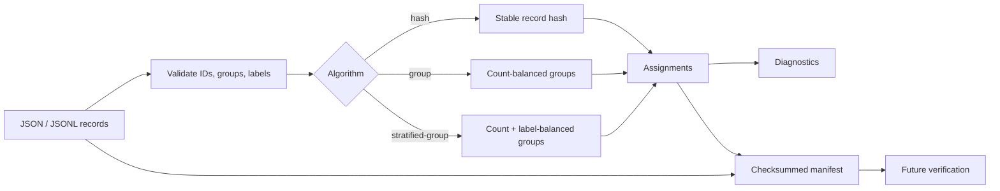

# SplitProof

SplitProof creates reproducible train/validation/test and k-fold assignments for NLP datasets.
It treats conversation, document, speaker, patient, or source groups as indivisible units and
writes a checksummed manifest that can later prove the exact data and assignments still match.

[](https://github.com/appleweiping/splitproof/actions/workflows/ci.yml)
[](https://www.python.org/)
[](LICENSE)

SplitProof has no runtime dependencies. It never uses Python's process-randomized built-in
`hash()` for persisted decisions.

## Why it exists

Randomly splitting utterances can place two turns from one conversation on opposite sides of
an evaluation boundary. Re-running a notebook can silently produce a different test set. A
saved list of IDs helps, but it cannot tell whether the dataset changed or the list was edited.

SplitProof makes these concerns explicit:

- stable, versioned BLAKE2b hashing with seed domain separation;
- group-aware balancing and optional label stratification;
- deterministic k-fold assignment;
- coverage, label-drift, ratio-deviation, and group-leakage diagnostics;
- a dataset fingerprint plus whole-manifest checksum;
- JSON and JSONL input, JSONL assignments, and Markdown/JSON reports.

## How it works



The group algorithms sort indivisible groups by size (and, for stratification, label rarity),
then place each group where it best reduces the current target deviation. Stable digests break
ties. This is a deterministic greedy optimization, not a stochastic solver.

## Install

Install the latest source from GitHub:

```bash
python -m pip install "git+https://github.com/appleweiping/splitproof.git"
```

For a source checkout:

```bash
python -m pip install -e ".[dev]"
```

Python 3.10 through 3.13 are supported.

## Quick start

Each input row needs a unique `id`. `group` and `label` are optional for ordinary splits and
required as applicable to the chosen guarantees:

```json
{"id":"turn-001","group":"conversation-01","label":"question","text":"Where is my order?"}
{"id":"turn-002","group":"conversation-01","label":"answer","text":"It ships today."}
```

Create an order-independent, stratified group split:

```bash
splitproof split examples/support_messages.jsonl \
  --algorithm stratified-group \
  --ratios train=0.6,validation=0.2,test=0.2 \
  --seed release-2026-09 \
  --assignments support.assignments.jsonl \
  --manifest support.manifest.json
```

Actual output from the bundled example:

```text
# SplitProof diagnostics

Status: **PASS**

| Split | Records | Observed ratio |
|---|---:|---:|
| `test` | 2 | 0.2000 |
| `train` | 6 | 0.6000 |
| `validation` | 2 | 0.2000 |

Maximum requested-ratio deviation: `0.000000`

Leaking groups: `0`
Missing record IDs: `0`
Unexpected record IDs: `0`
```

Before training or evaluation later, verify the manifest against current data and explicitly
compare the external assignments file that the downstream job will consume:

```bash
splitproof verify examples/support_messages.jsonl \
  --manifest support.manifest.json \
  --assignments support.assignments.jsonl
```

Successful verification checks the manifest checksum, dataset fingerprint, coverage, duplicate
assignments, declared split names, algorithm-specific group rules, and—when `--assignments` is
provided—the external file item by item. Without that option, no external assignments file is
read or claimed to be verified. Verification exits nonzero and explains every detected mismatch.
Input, assignment, manifest, and report paths must have distinct filesystem identities whenever
they play different CLI roles, so a command cannot silently overwrite its own evidence or source
dataset.

## CLI reference

### `split`

Algorithms:

| Algorithm | Groups stay together | Labels balanced | Existing rows stable after append |
|---|:---:|:---:|:---:|
| `hash` | No | No | Yes |
| `group` | Yes | No | No |
| `stratified-group` | Yes | Yes, best effort | No |

Use `--id-field`, `--group-field`, and `--label-field` for other schemas. Ratios must be finite,
strictly positive, uniquely named, and sum to one within `1e-9`. Split names are sorted before
hash intervals are constructed, so mapping or CLI ordering does not affect assignments.

### `kfold`

```bash
splitproof kfold examples/support_messages.jsonl --folds 5 --stratified \
  --seed experiment-4 --assignments folds.jsonl --manifest folds.manifest.json
```

The number of folds cannot exceed the number of indivisible groups.

### `verify` and `inspect`

```bash
splitproof inspect examples/support_messages.jsonl --manifest support.manifest.json
splitproof inspect examples/support_messages.jsonl --manifest support.manifest.json \
  --format json --output diagnostics.json
```

`inspect` first performs the same manifest and dataset integrity checks as `verify`; it never
prints a passing diagnostic report for a checksum or fingerprint mismatch.

## Python API

```python
from splitproof import Record, create_manifest, stratified_group_split, verify_manifest

records = [
    Record("m1", group="thread-a", label="question"),
    Record("m2", group="thread-a", label="answer"),
    Record("m3", group="thread-b", label="question"),
]
ratios = {"train": 0.67, "test": 0.33}
assignments = stratified_group_split(records, ratios, seed="v1")
manifest = create_manifest(
    records,
    assignments,
    algorithm="stratified-group",
    algorithm_version="2",
    seed="v1",
    ratios=ratios,
)
assert verify_manifest(manifest, records) == ()
```

`minimum_counts={"train": 1, "test": 1}` can be supplied to split functions when empty
partitions must be rejected. An impossible minimum raises `ConstraintError`; SplitProof never
quietly violates that explicit constraint.

## Reproducibility guarantees

For a fixed algorithm version, seed, ratios, and set of `(id, group, label)` tuples:

1. Input row order does not affect assignments.
2. Python version, process hash seed, locale, and machine do not affect persistent hashes.
3. Group-aware algorithms never split a non-null group.
4. A changed ID, group, label, assignment, option, or metadata value invalidates verification.
5. Record-hash assignment is append-stable for existing IDs.

The manifest intentionally fingerprints only fields that affect splitting. Changes to text or
other payload fields do not invalidate it. If content integrity matters, derive IDs from content
or record a separate content checksum in your data pipeline. Details are in
[Reproducibility](docs/reproducibility.md).

## Constraints and honest limitations

- Indivisible groups can make exact ratios or exact per-label proportions mathematically
  impossible. Group algorithms return a documented deterministic best effort.
- The stratified algorithm supports one categorical label per record. Multi-label and weighted
  rows are not yet modeled.
- The greedy objective favors predictable runtime and explainability; it does not claim a global
  optimum.
- Hash splitting is append-stable, while balanced algorithms may move existing groups when the
  dataset changes. The manifest prevents that from happening silently.
- Files are loaded into memory. Streaming assignment is a future option for record-hash mode.

## Project layout

```text
src/splitproof/       library and CLI
tests/                unit and end-to-end tests
examples/             small synthetic runnable dataset
docs/                 architecture and reproducibility contract
.github/workflows/    Python 3.10-3.13 CI
```

## Roadmap

- multi-label and weighted stratification;
- opt-in exact optimization for smaller datasets;
- streaming fingerprints and hash assignments;
- manifest schema migration commands;
- pluggable content fingerprint fields.

See [Architecture](docs/architecture.md), [Contributing](CONTRIBUTING.md), and the
[Changelog](CHANGELOG.md). SplitProof is available under the [MIT License](LICENSE).
