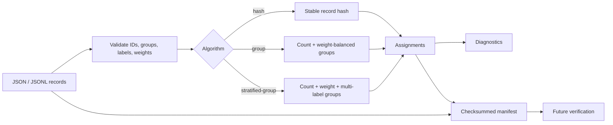

# SplitProof

SplitProof creates reproducible, weighted train/validation/test and k-fold assignments for NLP
datasets. It treats conversation, document, speaker, patient, or source groups as indivisible
units, balances multi-label distributions, and writes a checksummed manifest that can later prove
the exact split inputs and assignments still match.

[](https://github.com/appleweiping/splitproof/actions/workflows/ci.yml)
[](https://github.com/appleweiping/splitproof/actions/workflows/codeql.yml)
[](https://scorecard.dev/viewer/?uri=github.com/appleweiping/splitproof)
[](https://github.com/appleweiping/splitproof/releases)
[](https://www.python.org/)
[](LICENSE)

SplitProof has no runtime dependencies. It never uses Python's process-randomized built-in
`hash()` for persisted decisions.

## Why it exists

Randomly splitting utterances can place two turns from one conversation on opposite sides of
an evaluation boundary. Re-running a notebook can silently produce a different test set. A
saved list of IDs helps, but it cannot tell whether the dataset changed or the list was edited.

SplitProof makes these concerns explicit:

- stable, versioned BLAKE2b hashing with seed domain separation;
- record and group weights with group-aware balancing;
- single-label and multi-label weighted stratification;
- deterministic greedy placement followed by bounded local improvement;
- deterministic k-fold assignment;
- coverage, count/weight/label drift, objective, and group-leakage diagnostics;
- a dataset fingerprint plus whole-manifest checksum;
- JSON and JSONL input, JSONL assignments, and Markdown/JSON reports.

## How it works



The group algorithms sort indivisible groups by effective weight, record weight, size, and
weighted label rarity. Greedy placement minimizes one documented scale-free objective. A bounded
local search then accepts only strictly improving single-group moves and, for at most 32 groups,
pair swaps. Stable BLAKE2 digests break equal-score ties. The finite iteration limit and strict
decrease rule make termination explicit and repeatable.

## Install

Install the latest source from GitHub:

```bash
python -m pip install "git+https://github.com/appleweiping/splitproof.git"
```

For a source checkout:

```bash
python -m pip install -e ".[dev]"
```

Python 3.10 through 3.14 are supported.

## Quick start

Each input row needs a unique `id`. `group`, `label`, `weight`, and `group_weight` are optional for
ordinary splits. A label may be one scalar or an array; stratified operations require at least one
label per row; an empty label array is therefore valid only for unstratified operations. Record
weights default to `1.0`. Both weight fields must be finite, strictly positive numbers (JSON
booleans are not numbers here). A supplied group weight is counted once for the indivisible group,
and all supplied values for the same named group must agree:

```json
{"id":"turn-001","group":"conversation-01","label":["question","urgent"],"weight":2.0,"group_weight":3.0,"text":"Where is my order?"}
{"id":"turn-002","group":"conversation-01","label":["answer"],"weight":1.0,"group_weight":3.0,"text":"It ships today."}
```

[`examples/weighted_multilabel.jsonl`](examples/weighted_multilabel.jsonl) is a complete runnable
version of this schema.

Create an order-independent, stratified group split:

```bash
splitproof split examples/support_messages.jsonl \
  --algorithm stratified-group \
  --ratios train=0.6,validation=0.2,test=0.2 \
  --seed release-2026-09 \
  --assignments support.assignments.jsonl \
  --manifest support.manifest.json
```

Output excerpt from the bundled example:

```text
# SplitProof diagnostics

Status: **PASS**

| Split | Records | Record ratio | Record weight | Weight ratio | Group-weight ratio |
|---|---:|---:|---:|---:|---:|
| `test` | 2 | 0.2000 | 2.0000 | 0.2000 | 0.2000 |
| `train` | 6 | 0.6000 | 6.0000 | 0.6000 | 0.6000 |
| `validation` | 2 | 0.2000 | 2.0000 | 0.2000 | 0.2000 |

Balance deviations:

- record count: `0.000000`
- record weight: `0.000000`
- effective group weight: `0.000000`
- per-label weight: `0.000000`
- optimizer objective: `0.00000000`

Leaking groups: `0`
Missing record IDs: `0`
Unexpected record IDs: `0`
```

Before training or evaluation later, verify the manifest against current data and explicitly
compare the external assignments file that the downstream job will consume:

```bash
splitproof verify examples/support_messages.jsonl \
  --manifest support.manifest.json \
  --assignments support.assignments.jsonl
```

Successful verification checks the manifest checksum, dataset fingerprint, coverage, duplicate
assignments, declared split names, algorithm-specific group rules, and—when `--assignments` is
provided—the external file item by item. Without that option, no external assignments file is
read or claimed to be verified. Verification exits nonzero and explains every detected mismatch.
Input, assignment, manifest, and report paths must have distinct filesystem identities whenever
they play different CLI roles, so a command cannot silently overwrite its own evidence or source
dataset.

## CLI reference

### `split`

Algorithms:

| Algorithm | Groups stay together | Weighted labels balanced | Existing rows stable after append |
|---|:---:|:---:|:---:|
| `hash` | No | No | Yes |
| `group` | Yes | No | No |
| `stratified-group` | Yes | Yes, best effort | No |

Use `--id-field`, `--group-field`, and `--label-field` for other schemas. Ratios must be finite,
strictly positive, uniquely named, and sum to one within `1e-9`. Split names are sorted before
hash intervals are constructed, so mapping or CLI ordering does not affect assignments.
`--weight-field` and `--group-weight-field` select custom weight columns.
Repeat every custom field mapping on `verify` and `inspect` so the reconstructed records match the
manifest fingerprint.

Group algorithms accept `--max-local-iterations N`. Omitting it selects the deterministic bound
`min(200, 2 * number_of_groups)`; `0` exposes the greedy-only baseline. Record-hash mode rejects
this option because it has no optimization phase.

The optional `expected_ratios` argument to `diagnose()` uses the same finite, positive,
sum-to-one validation as assignment ratios, so a diagnostic report cannot silently contain a
non-finite objective.

### `kfold`

```bash
splitproof kfold examples/support_messages.jsonl --folds 5 --stratified \
  --seed experiment-4 --assignments folds.jsonl --manifest folds.manifest.json
```

The number of folds cannot exceed the number of indivisible groups.

### `verify` and `inspect`

```bash
splitproof inspect examples/support_messages.jsonl --manifest support.manifest.json
splitproof inspect examples/support_messages.jsonl --manifest support.manifest.json \
  --format json --output diagnostics.json
```

`inspect` first performs the same manifest and dataset integrity checks as `verify`; it never
prints a passing diagnostic report for a checksum or fingerprint mismatch.

## Python API

```python
from splitproof import Record, create_manifest, stratified_group_split, verify_manifest

records = [
    Record("m1", group="thread-a", labels=("question", "urgent"), weight=2),
    Record("m2", group="thread-a", labels=("answer",), weight=1),
    Record("m3", group="thread-b", labels=("question",), weight=1.5),
]
ratios = {"train": 0.67, "test": 0.33}
assignments = stratified_group_split(records, ratios, seed="v1")
manifest = create_manifest(
    records,
    assignments,
    algorithm="stratified-group",
    algorithm_version="3",
    seed="v1",
    ratios=ratios,
)
assert verify_manifest(manifest, records) == ()
```

`minimum_counts={"train": 1, "test": 1}` can be supplied to split functions when empty
partitions must be rejected. An impossible minimum raises `ConstraintError`; SplitProof never
quietly violates that explicit constraint.

## Reproducibility guarantees

For a fixed algorithm version, seed, ratios, and set of
`(id, group, normalized labels, record weight, group weight)` records:

1. Input row order does not affect assignments.
2. Python version, process hash seed, locale, and machine do not affect persistent hashes.
3. Group-aware algorithms never split a non-null group.
4. A changed ID, group, label set, record weight, group weight, assignment, option, or metadata
   value invalidates a schema-v2 verification.
5. Record-hash assignment is append-stable for existing IDs.

The manifest fingerprints normalized split and balance inputs. Hash assignment itself ignores
weights, but its schema-v2 manifest still protects the weight diagnostics recorded for that split.
Changes to text or other payload fields do not invalidate it. If content integrity matters,
derive IDs from content or record a separate content checksum in your data pipeline. Details are in
[Reproducibility](docs/reproducibility.md).
Legacy users should follow the explicit [schema-v1 migration guide](docs/migration-v2.md) rather
than replacing a published manifest in place.

## Constraints and honest limitations

- Indivisible groups can make exact ratios or exact per-label proportions mathematically
  impossible. Group algorithms return a documented deterministic best effort.
- Multi-label balance is best effort when rare labels are concentrated in indivisible groups.
- The greedy-plus-local optimizer favors predictable runtime and explainability; it does not claim
  a global optimum.
- Hash splitting is append-stable, while balanced algorithms may move existing groups when the
  dataset changes. The manifest prevents that from happening silently.
- Files are loaded into memory. Streaming assignment is a future option for record-hash mode.

## Project layout

```text
src/splitproof/       library and CLI
tests/                unit and end-to-end tests
examples/             small synthetic runnable dataset
docs/                 architecture and reproducibility contract
benchmarks/           fixed quality benchmark and committed v0.2 result
.github/workflows/    Python 3.10-3.14 CI
```

## Reproducible quality benchmark

Run `python benchmarks/compare_methods.py` to reproduce
[`results-v0.2.json`](benchmarks/results-v0.2.json). The fixed 150-record corpus compares a seeded
random group baseline, record hashing, the released v2 count/single-label greedy method, the v3
greedy stage, and the full v3 optimizer. In the committed run, v3 greedy scores `0.0229607081`
versus v2's `0.1200373454`; local improvement reduces v3 further to `0.0083414534`. All group-aware
variants have zero group leakage and identical assignments after input reversal. The benchmark
reports quality rather than wall-clock time so its artifact is stable across machines.
Because v2 had no multi-label or weight model, its benchmark adapter explicitly selects each
record's first normalized label and ignores both weight fields.

## Roadmap

- opt-in exact optimization for smaller datasets;
- streaming fingerprints and hash assignments;
- manifest schema migration commands;
- pluggable content fingerprint fields.

See [Architecture](docs/architecture.md), [Contributing](CONTRIBUTING.md), and the
[Changelog](CHANGELOG.md). SplitProof is available under the [MIT License](LICENSE).
